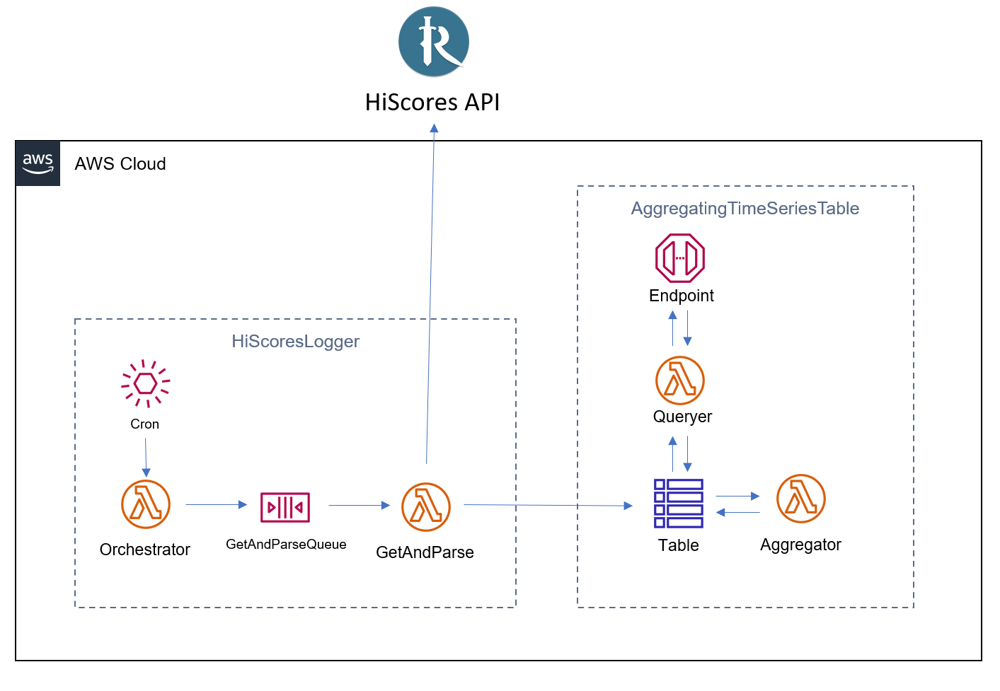

OSRS HiScores Tracking with AWS CDK
====================================


# Background

This project helps OSRS players to track and visualize their in-game progress using the HiScores API. It is built on Amazon Web Services and is easily bootstrapped using AWS CDK. As such, having an AWS account and the AWS CLI installed is a prerequisite.


# Service overview



The core service is built on two Constructs: `HiScoresLogger` and `AggregatingTimeSeriesTable`. 

The first uses a CloudWatch EventBridge to trigger an Orchestrator Lambda, which reads your configuration file and sends instruction messages to an SQS Queue. A Lambda Function listens to this queue, and when it receives a request for a username, it queries the HiScores API, parses the response, and saves it to a table.

The second is a Dynmo Table with a Lambda Function subscribed to write events. When the table is written to, the Lambda aggregates the new record into a daily sum row. The table also comes with a queryer Lambda Function and API Gateway Endpoint for easy reading with configurable daily aggregation.

# Getting Started
You can create an instance of this service for yourself using AWS CDK. Follow these steps to get started.

## Prerequisites

### 1. Install Python
You can find the latest release at https://www.python.org/downloads/. As of writing, we are on 3.8.10.

### 2. Create a free-tier AWS account
If you don't already have one, go to https://aws.amazon.com/free and sign up.

### 3. Configure permissions
You will need to create a new IAM policy to deploy this application. After creating your account, navigate to IAM within the AWS management console. Create a new policy with the following permissions:
* IAMFullAccess
* AWSCodeDeployFullAccess
* AdministratorAccess
* AWSCloudFormationFullAccess

Now, create a new IAM group and attach this policy to it. Following this, create a user in the group for yourself.

### 4. Install the AWS CLI
Follow [these instructions](https://docs.aws.amazon.com/cli/latest/userguide/getting-started-install.html). To verify that it works: `which aws`.

### 5. Configure the AWS CLI
With the IAM user you created above, follow [these instructions](https://docs.aws.amazon.com/cli/latest/userguide/cli-configure-quickstart.html#cli-configure-quickstart-creds) to configure your AWS CLI.

### 6. Install the CDK CLI

```bash
npm install -g aws-cdk@2.0.0
```

## Clone the repo

```bash
git clone https://github.com/awerchniak/cdk-hiscores-tracker.git
cd cdk-hiscores-tracker
```

## Configure
Edit the file located at `lambda/orchestrator/players.txt` to use the usernames of the players you would like to track (minimum: 1).

## Build and deploy

```bash
python -m venv .venv
source .venv/bin/activate
pip install -r requirements.txt
cdk bootstrap aws://ACCOUNT-NUMBER/REGION
cdk deploy
```

You can now navigate to the AWS console and see your resources created. Take a look at the Service Overview below to get oriented. In particular, see DynamoDB and Lambda.

At the end of the terminal output, you should see something like:
```
Outputs:
HiscoresTrackerStack.HiScoresATSTQueryHiScoresDataEndpointB5BC150F = https://511h1wh89e.execute-api.us-east-1.amazonaws.com/prod/
HiscoresTrackerStack.TriggerHiScoresLogEventEndpointBCAB06A2 = https://n2mtfqtg7h.execute-api.us-east-1.amazonaws.com/prod/
```

Your Stack name and URL will be slightly different. Make note of these URLs; they are public APIs
you can use to interact with your service.

The first, QueryHiScoresDataEndpoint, is a public Rest API you can call to query your stats datatabse. It supports `GET` and takes 3 parameters: `{player: str, startTime: str, endTime: str}`.

The second, TriggerHiScoresLogEventEndpoint, is a public Rest API you can call to trigger a save event to your stats database. It supports `POST` and takes no parameters.

## Cleanup

When you are finished, you can destroy all resources with:

```bash
cdk destroy
```

# Contributing

We welcome contributions. If you would like to contribute, please fork the repo and issue a pull request with your changes. We will respond to all PRs within a 1 week SLA. Prior to submitting your pull request, ensure all tests are passing.

## Running unit tests
```bash
pip install -r requirements-dev.txt
bash run_tests.sh
```

## Running integration tests
This repo contains an extremely simple integration test that triggers a save event and verifies that the data is returned in a query. To run it, make note of your Log API and Query API from the "Deploy" section, and issue the following command:

```bash
python run_integration_test.py \
    -i YOUR_TRIGGER_LOG_EVENT_URL \
    -o YOUR_QUERY_DATABASE_URL
```

For example, using the example deployment from above, the tests can be run like the following:

```bash
python run_integration_test.py \
    -i https://n2mtfqtg7h.execute-api.us-east-1.amazonaws.com/prod/ \
    -o https://511h1wh89e.execute-api.us-east-1.amazonaws.com/prod/
```
